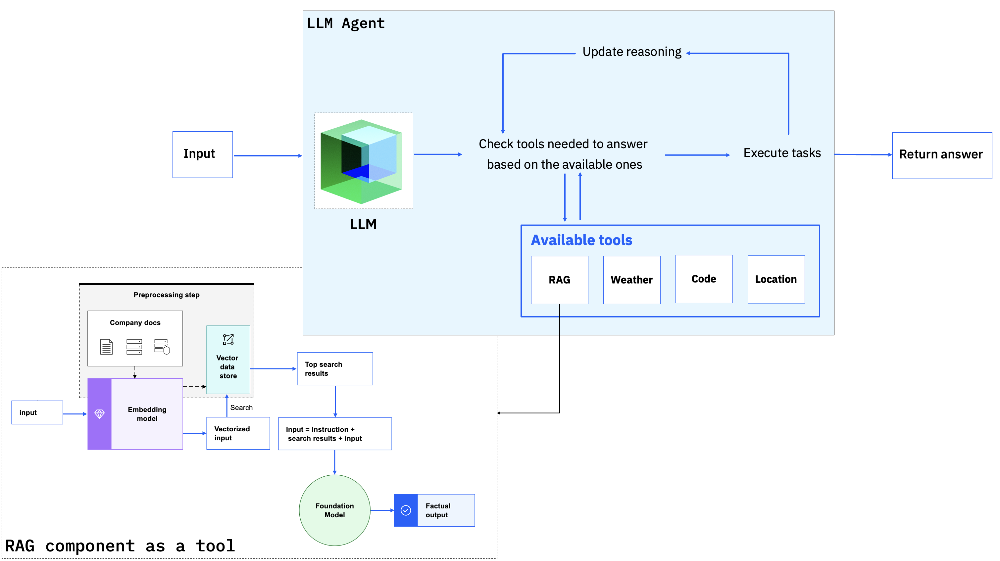

# Agentic RAG com Granite-3.0-8B-Instruct no watsonx.ai

## Referências
- [Granite cookbooks](https://github.com/ibm-granite-community)
- [Watsonx API - modelos embeddings](https://cloud.ibm.com/apidocs/watsonx-ai#text-embeddings);
- [LangChain docs - watsonx.ai](https://python.langchain.com/v0.2/docs/integrations/text_embedding/ibm_watsonx/);
- [Mais sobre RAG](https://dataplatform.cloud.ibm.com/docs/content/wsj/analyze-data/fm-rag.html?context=wx&audience=wdp);